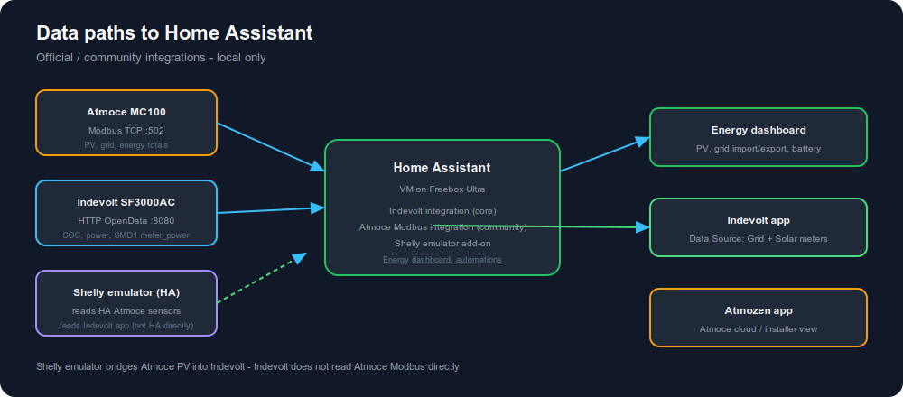

# ha-atmoce-indevolt

Home Assistant custom integration for a hybrid home energy management system (HEMS) built from:

- **Atmoce** PV ecosystem (18× 500 W panels on 9× 1000 W microinverters via **MC100 combiner**, Modbus TCP)
- **Indevolt SF3000AC** AC-coupled storage inverter
- **Indevolt SFA3600** extended battery pack(s)
- **Solarman SMD1** LoRa smart meter (whole-home load via SF3000)

The integration talks to both vendors **locally** (no cloud required) and exposes unified sensors, controls, and HEMS metrics for automations and the Energy dashboard.

[](docs/diagrams/data-flow.svg)

## Features

- Atmoce PV, grid, and cumulative energy sensors via Modbus TCP
- Indevolt battery SOC, power, AC flow, per-pack SOC (SFA modules), and limits via HTTP OpenData
- HEMS computed sensors when both sides are configured:
  - Site consumption
  - PV surplus
  - Self-consumption rate
- Indevolt controls: energy mode, backup SOC, feed-in limit, max AC output, grid charging
- Services: `ha_atmoce_indevolt.charge_battery`, `ha_atmoce_indevolt.discharge_battery`
- Example automations package for surplus charging

## Prerequisites

### Atmoce MC100 combiner

1. **MC100** combiner (aggregates microinverter strings) or **MG100** gateway with Modbus TCP enabled (default port `502`).
2. Enable Modbus in the **Atmozen** app if your installer has not already done so.
3. Combiner and Home Assistant on the same LAN.

Typical array: **18 panels × 500 W** (9 kWp) on **9 microinverters × 1000 W** (two panels per unit).

### Solarman SMD1 meter

1. Pair the clamp meter to the **SF3000AC** in the Indevolt app (LoRa recommended).
2. Enable **meter** load mode for zero-export / self-consumption.
3. HA reads `meter_power` through the Indevolt integration — no separate Solarman integration.

See [`docs/smd1-meter.md`](docs/smd1-meter.md).

### Indevolt SF3000AC

1. Create a **direct device connection** in the Indevolt app.
2. Enable **Local API** and choose protocol **HTTP** (not HTTPS for now).
3. Note the device IP (router, app, or UDP discovery on port `8099` / `AT+IGDEVICEIP`).
4. Default OpenData port is usually `8080`.

## Installation

### HACS (recommended)

1. Add this repository as a custom HACS integration.
2. Install **Atmoce + Indevolt HEMS**.
3. Restart Home Assistant.

### Manual

Copy `custom_components/ha_atmoce_indevolt` into your Home Assistant `config/custom_components/` directory and restart.

## Configuration

1. **Settings → Devices & Services → Add Integration**
2. Search for **Atmoce + Indevolt HEMS**
3. Enter:
   - Atmoce combiner IP (panel count default 18, microinverter count default 9)
   - Indevolt device IP
   - Optional polling interval (default 30 s)

At least one device IP is required.

## Energy dashboard

Map entities in **Settings → Dashboards → Energy**:

| Role | Suggested entity |
|------|------------------|
| Solar production | `sensor.*_pv_power` |
| Grid consumption | `sensor.*_grid_power` (configure sign in Energy UI) |
| Battery | `sensor.*_battery_soc` / `sensor.*_battery_power` |

See `docs/energy-dashboard.md` for a full example.

## Atmozen-style dashboard

A dark, mobile-friendly Lovelace dashboard (energy flow, live kW chips, 24h chart) inspired by the Atmozen app.

See [`docs/dashboard.md`](docs/dashboard.md) for setup (HACS cards + `packages/atmozen_dashboard.yaml` + `dashboards/atmozen.yaml`).

## HEMS automations

Optional package:

```yaml
# configuration.yaml
homeassistant:
  packages:
    ha_atmoce_indevolt_hems: !include packages/ha_atmoce_indevolt_hems.yaml
```

This adds a surplus-charging automation that starts Indevolt charging when Atmoce PV surplus exceeds a threshold.

## Architecture

```
Atmoce MC100 ──Modbus TCP──► HA integration ──► HEMS coordinator ──► sensors / automations
Indevolt SF3000AC ──HTTP OpenData──►           ▲
SFA3600 pack(s) ───────────────────────────────┘
```

## Development

```bash
python3 -m compileall custom_components/ha_atmoce_indevolt
```

## References

- [Indevolt OpenData API](https://github.com/INDEVOLT/indevolt-doc/blob/main/docs/hardware/geek/open-data.md)
- [Home Assistant Indevolt integration](https://www.home-assistant.io/integrations/indevolt/)
- [evcc Atmoce Modbus template](https://github.com/evcc-io/evcc/blob/master/templates/definition/meter/atmoce.yaml)
- [Atmoce community HA integration](https://github.com/pacorola/Atmoce_battery_HA)

## License

MIT
