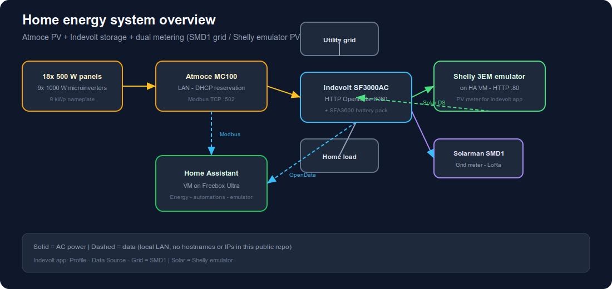

# Home energy setup — Atmoce + Indevolt

Documentation for a hybrid home energy system (HEMS): **Atmoce** solar, **Indevolt** battery storage, **Home Assistant** monitoring, and **dual metering** in the Indevolt app.

This repository is **documentation only** — no integration code. It describes hardware roles, ports, protocols, and data flow. **No real hostnames, IP addresses, or credentials are stored here**; use your own LAN reservations and secrets locally.

[](docs/diagrams/system-overview.svg)

## Hardware

| Component | Role | Network |
|-----------|------|---------|
| 18× 500 W Atmoce panels + 9× 1000 W microinverters | Solar (9 kWp) | — |
| **Atmoce MC100** combiner | PV aggregation, grid CT, Modbus API | LAN · DHCP reservation |
| **Indevolt SF3000AC** | AC-coupled inverter / storage controller | LAN · DHCP reservation |
| **Indevolt SFA3600** | LiFePO₄ battery pack | via SF3000 |
| **Solarman SMD1** (LoRa) | Whole-home **grid** meter → SF3000 | via Indevolt app |
| **Shelly Pro 3EM emulator** (HA add-on) | **PV** meter for Indevolt app | HTTP **:80** on HA host |
| **Home Assistant** | Monitoring, Energy dashboard, emulator host | **VM on Freebox Ultra** |

## Home Assistant host

Home Assistant runs as a **virtual machine on Freebox Ultra** (Freebox OS). The Shelly PV emulator add-on uses **host networking**, so `mdns_host` and the IP entered in the Indevolt app must be the **VM’s LAN address** assigned by the Freebox router — not a placeholder from this repo.

## Diagrams

| Diagram | Description |
|---------|-------------|
| [System overview](docs/diagrams/system-overview.svg) ([png](docs/diagrams/system-overview.png)) | Full physical + data layout |
| [Data paths to HA](docs/diagrams/data-flow.svg) ([png](docs/diagrams/data-flow.png)) | Modbus, OpenData, emulator |
| [Dual metering](docs/diagrams/dual-metering.svg) ([png](docs/diagrams/dual-metering.png)) | Grid (SMD1) + Solar (Shelly emulator) |

GitHub README uses **PNG** for inline previews; click through to **SVG** for full resolution.

## Documentation

| Guide | Contents |
|-------|----------|
| [Setup guide](docs/setup.md) | DHCP reservations, first-time checklist |
| [Atmoce Modbus](docs/atmoce-modbus.md) | Connect clients to MC100 on port 502 |
| [Indevolt SF3000](docs/indevolt-sf3000.md) | Local API, app, battery |
| [PV meter emulator](docs/pv-meter-emulator.md) | Shelly 3EM simulator → Indevolt Solar data source |
| [SMD1 grid meter](docs/smd1-meter.md) | LoRa clamp meter → Indevolt Grid data source |
| [Home Assistant](docs/home-assistant.md) | VM on Freebox Ultra, integrations |
| [Energy dashboard](docs/energy-dashboard.md) | HA Energy UI entity mapping |

## Quick reference

```text
Atmoce MC100     Modbus TCP  <mc100-host>:502    unit ID 1
Indevolt SF3000  HTTP        <sf3000-host>:8080  OpenData API
Home Assistant   VM          Freebox Ultra       UI :8123
Shelly emulator  HTTP        <ha-host>:80        Indevolt app (not :8812)
Indevolt app     Data Source Grid  → SMD1
                 Data Source Solar → Shelly emulator (Atmoce pv_power)
```

Replace `<mc100-host>`, `<sf3000-host>`, and `<ha-host>` with addresses from your router or Freebox device list.

## External references

- [Indevolt OpenData API](https://github.com/INDEVOLT/indevolt-doc/blob/main/docs/hardware/geek/open-data.md)
- [Indevolt dual metering (third-party PV)](https://docs.indevolt.com/docs/hardware/advanced/third-party-inverter-dual-metering)
- [Home Assistant Indevolt integration](https://www.home-assistant.io/integrations/indevolt/)
- [Shelly Pro 3EM emulator](https://github.com/bvweerd/shelly_em3pro_emulator)
- [evcc Atmoce Modbus template](https://github.com/evcc-io/evcc/blob/master/templates/definition/meter/atmoce.yaml)

## License

MIT
