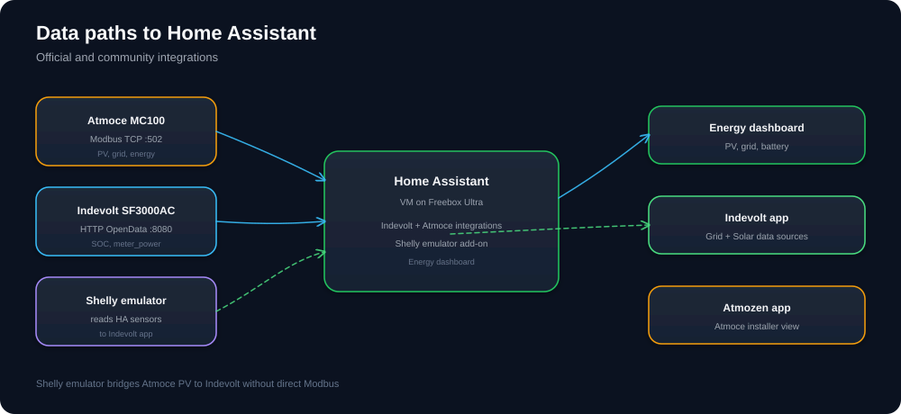

# Atmoce MC100 — Modbus TCP

The MC100 combiner (with integrated MG100 gateway) exposes a **Modbus TCP server**. External systems connect **to** Atmoce — Atmoce does not act as a Modbus client to other servers.

[](diagrams/data-flow.svg)

## Connection parameters

| Parameter | Value |
|-----------|--------|
| Host | MC100 IP (`192.168.1.8`) |
| Port | `502` |
| Unit / slave ID | `1` |
| Register type | Holding registers |
| Protocol | Atmoce-specific map (`60000+`), **not** SunSpec |

## Enable Modbus

1. **Atmozen** app — confirm combiner online.
2. Installer enables **Modbus TCP** (may not be visible to end users).
3. Firmware **01.01.00.18.10+** required ([evcc docs](https://docs.evcc.io/en/meters/atmoce-mg100-m-gateway)).
4. Test:

```bash
nc -zv 192.168.1.8 502
```

> **Note:** **MC100L** may not support third-party Modbus. This setup uses **MC100** with MG100.

## Register map (common)

From the [evcc Atmoce template](https://github.com/evcc-io/evcc/blob/master/templates/definition/meter/atmoce.yaml) and Atmoce Modbus protocol PDF:

| Register | Description | Unit |
|----------|-------------|------|
| `60069` | PV power | W |
| `60073` | Grid power (signed: + import, − export) | W |
| `60095` | Battery SOC (if Atmoce battery present) | % |
| `60160` | PV energy total | kWh |
| `60184` | Grid import energy total | kWh |
| `60178` | Grid export energy total | kWh |

## Who connects to Atmoce?

| Client | Purpose |
|--------|---------|
| **Home Assistant** | Community Atmoce Modbus integration → sensors |
| **evcc** | Smart charging / solar surplus |
| **GuyTec ModBus Client** | Desktop logging ([guytec.com/ModBus](https://guytec.com/ModBus/)) |

## Indevolt does not read Atmoce Modbus

The SF3000 cannot poll the MC100 directly. PV data reaches Indevolt via the **Shelly emulator** (see [pv-meter-emulator.md](pv-meter-emulator.md)):

```text
Atmoce (:502) → HA reads pv_power → Shelly emulator (:80) → Indevolt app
```

## Troubleshooting

| Symptom | Fix |
|---------|-----|
| Connection refused | Modbus not enabled; wrong IP |
| All zeros | MC100 offline; check Atmozen |
| Works from LAN but not HA | Guest Wi‑Fi / VLAN isolation |
