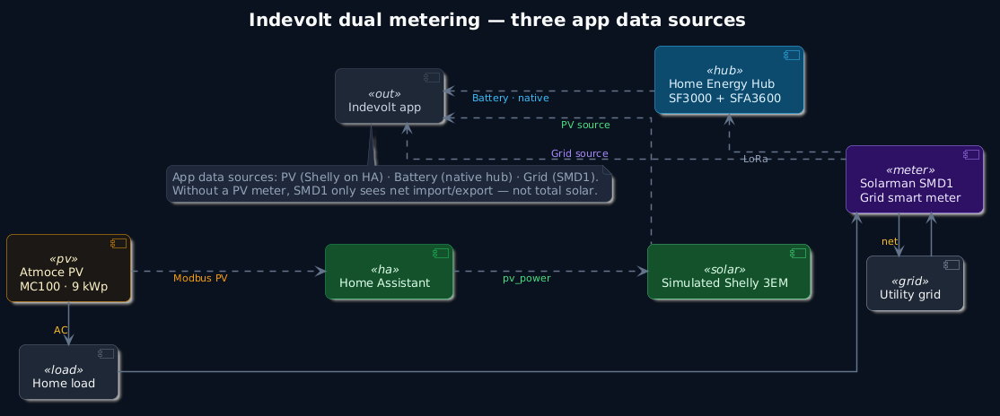

# Diagrams

[PlantUML](https://plantuml.com/) sources with a shared dark theme. GitHub shows **PNG** previews; click through to **SVG** for full resolution.

**Regenerate** after editing `.puml` files:

```bash
./docs/diagrams/render.sh
```

Requires [Podman](https://podman.io/) or Docker (`docker.io/plantuml/plantuml`), or a local `plantuml` install.

---

## System overview

Physical AC layout plus data paths. PV reaches the Indevolt app through HA and the Shelly emulator; battery and grid use native hub and SMD1 respectively.

[](diagrams/system-overview.svg)

Source: [`diagrams/system-overview.puml`](diagrams/system-overview.puml)

**Legend:** solid arrows = AC power · dashed arrows = data / control

---

## Data flow and dashboards

[](diagrams/data-flow.svg)

Source: [`diagrams/data-flow.puml`](diagrams/data-flow.puml)

| Path | Flow |
|------|------|
| **PV** | Atmoce MC100 → Modbus → Home Assistant → Shelly emulator → Indevolt app |
| **Battery** | Home Energy Hub → Indevolt app (native, no HA) |
| **Grid** | Solarman SMD1 (physical meter) → Indevolt app |
| **HA dashboard** | HA Energy UI — Atmoce entities (+ optional hub OpenData) |
| **Indevolt dashboard** | App UI — all three data sources for battery optimisation |

The hub does not read Atmoce Modbus; PV is bridged only through HA and the emulator.

---

## Indevolt dual metering

Third-party PV (Atmoce) with separate grid and solar meters. Based on [Indevolt dual metering](https://docs.indevolt.com/docs/hardware/advanced/third-party-inverter-dual-metering).

[](diagrams/dual-metering.svg)

Source: [`diagrams/dual-metering.puml`](diagrams/dual-metering.puml)

Without a dedicated PV meter (Shelly emulator), the SMD1 grid meter only sees net import/export — not total solar generation.
