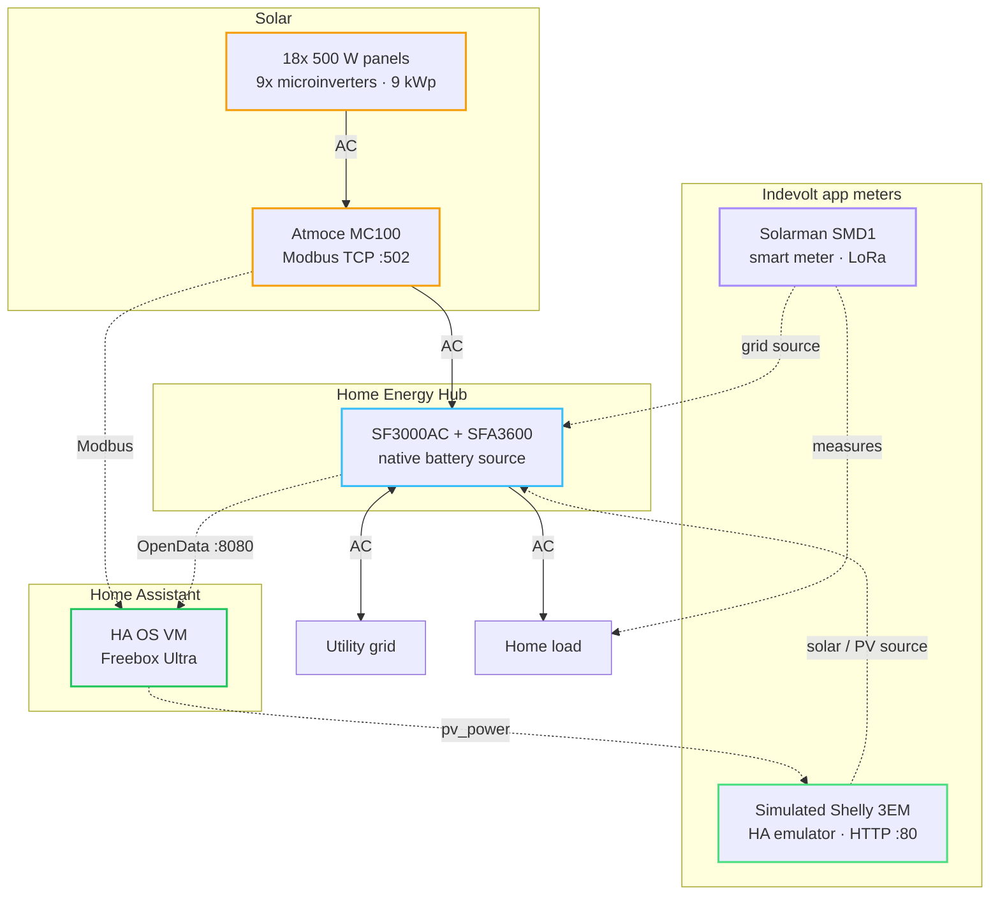
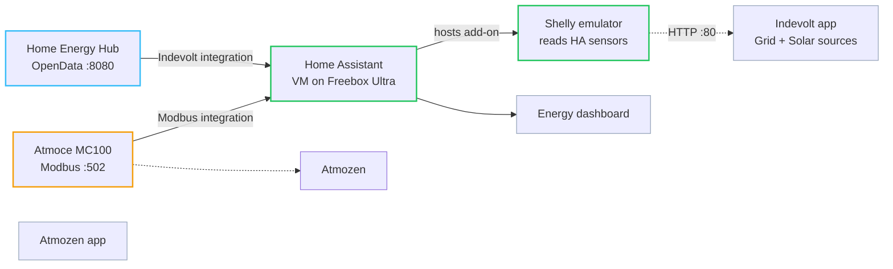
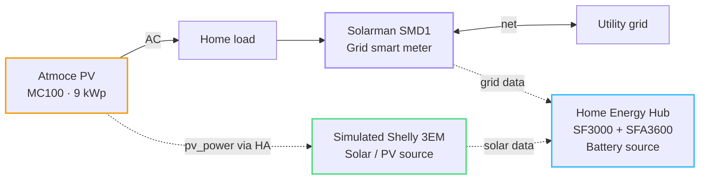

# Diagrams

Mermaid diagrams for this setup. GitHub renders these inline in markdown — no PNG or SVG required.

---

## System overview

Physical layout, data paths, and Indevolt app sources.

**Legend:** solid arrows = AC power · dotted arrows = data / control

**App sources:** Hub (battery) · SMD1 (grid) · Shelly emulator (PV)

---

## Data paths to Home Assistant

Shelly emulator bridges Atmoce PV into Indevolt — the SF3000 does not read Atmoce Modbus directly.

---

## Indevolt dual metering

Third-party PV (Atmoce) with separate grid and solar meters. Based on [Indevolt dual metering](https://docs.indevolt.com/docs/hardware/advanced/third-party-inverter-dual-metering).

Without a PV meter, the grid meter alone only sees net import/export — not total solar generation.
