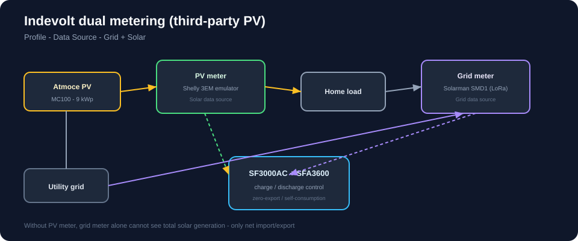

# PV meter — Shelly Pro 3EM emulator

Indevolt needs a **dedicated PV meter** when solar comes from a third-party inverter (Atmoce). A **Shelly Pro 3EM emulator** on Home Assistant repackages Atmoce `pv_power` as a fake Shelly meter for the Indevolt app.

[](diagrams/dual-metering.svg)

Source: [Indevolt dual metering for third-party inverters](https://docs.indevolt.com/docs/hardware/advanced/third-party-inverter-dual-metering)

## Why not Modbus from Atmoce?

Indevolt only supports specific meter brands (Shelly, Solarman, etc.) over **local HTTP/LoRa** — not Atmoce Modbus. The bridge is:

```text
Atmoce MC100 ──Modbus──► HA (pv_power sensor)
                              │
                              ▼
                    Shelly emulator (HTTP :80)
                              │
                              ▼
                    Indevolt app (Solar data source)
```

## Install emulator (HA add-on)

1. **Settings → Add-ons → Add-on Store → Repositories**  
   Add: `https://github.com/bvweerd/shelly_em3pro_emulator`
2. Install **Shelly Pro 3EM Emulator**, enable **host network**.
3. Configuration:

| Option | Value |
|--------|--------|
| `http_port` | **`80`** ← required for Indevolt |
| `auto_discover` | `false` |
| `mdns_host` | `192.168.1.75` |
| `mdns_enabled` | `true` |
| `http_enabled` | `true` |
| `udp_enabled` | `true` |
| `device_name` | `Atmoce PV Meter` |
| `single_phase_power` | Your Atmoce PV power entity |
| `energy_delivered` | Your Atmoce PV energy total entity |

Replace entity IDs with yours from **Developer tools → States** (community Atmoce integration names vary).

4. Start add-on and check logs for `HTTP server listening on ...:80`.

> **Port 80 fix:** Default add-on port `8812` causes **offline** in Indevolt. Indevolt connects to Shelly on port **80** only.

## Get Device ID

```bash
curl -s http://192.168.1.75/rpc/Shelly.GetDeviceInfo
```

Use the `"id"` field (e.g. `shellypro3em-aabb01`).

## Indevolt app pairing

1. **Add Device → Shelly → Pro 3EM**
2. IP: `192.168.1.75`, Device ID from curl above
3. **SF3000 → + Add Sub-Device** → link meter
4. **Profile → Data Source → Solar → Custom** → select emulator

## Verify

| Check | Expected |
|-------|----------|
| Phone browser `http://192.168.1.75/rpc/EM.GetStatus` | JSON with power > 0 in daylight |
| Indevolt device card | Online, live watts |
| Solar data source | Shows emulator name |

## Second emulator for grid (optional)

If not using SMD1, a **second** emulator instance (unique MAC, port 80 on another host) can map `grid_power` for **Grid** data source. One add-on cannot represent two Shelly devices.

## References

- [Shelly emulator repo](https://github.com/bvweerd/shelly_em3pro_emulator)
- [Indevolt Shelly Pro 3EM guide](https://blog.indevolt.com/en/how-to-integrate-the-shelly-pro-3em-electricity-meter-into-the-indevolt-app/)
