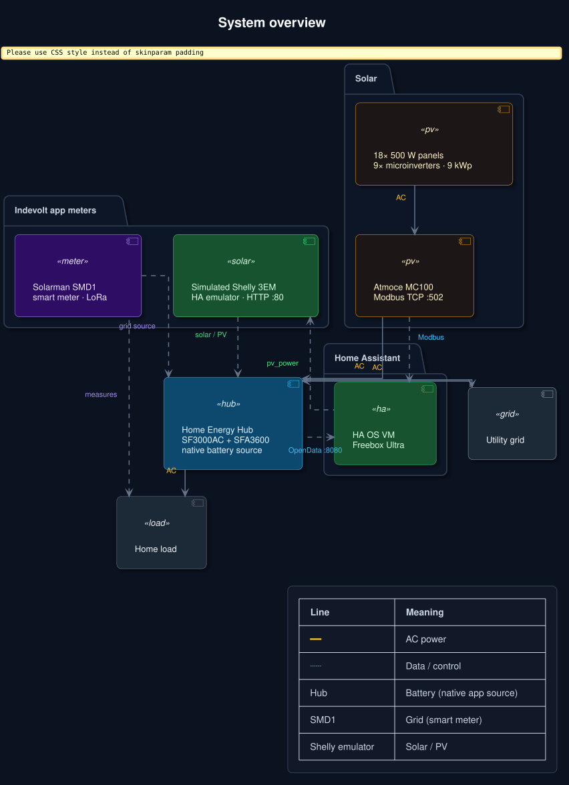

# Setup guide

[](diagrams/system-overview.svg)

## Hardware layout

| Component | Role |
|-----------|------|
| 18× 500 W Atmoce PV panels | Solar production (9 kWp nameplate) |
| 9× 1000 W microinverters (2 panels each) | DC/AC conversion |
| Atmoce **MC100** combiner | String aggregation, grid metering, Modbus API |
| Indevolt **SF3000AC** | AC-coupled hybrid inverter / storage controller |
| Indevolt **SFA3600** | Extended LiFePO₄ battery pack |
| Solarman **SMD1** (LoRa) | Whole-home **grid** meter → SF3000 |
| Shelly **Pro 3EM emulator** (HA add-on) | **PV** meter for Indevolt app |

## Network addresses

Reserve static DHCP leases:

| Device | Example IP | Port(s) |
|--------|------------|---------|
| Atmoce MC100 | `192.168.1.8` | Modbus TCP `502` |
| Home Assistant | `192.168.1.75` | `8123`, Shelly emulator HTTP `80` |
| Indevolt SF3000AC | e.g. `192.168.1.51` | OpenData HTTP `8080` |

All devices must be on the **same LAN** (no guest-network isolation).

## Phase 1 — Atmoce Modbus

1. Open **Atmozen** and confirm MC100 is online.
2. Ask installer to enable **Modbus TCP** if not visible.
3. Verify from a workstation:

```bash
nc -zv 192.168.1.8 502
```

See [atmoce-modbus.md](atmoce-modbus.md).

## Phase 2 — Indevolt local API

1. Indevolt app → profile → **direct device connection**.
2. SF3000 settings → **Local API** → protocol **HTTP**.
3. Verify OpenData:

```bash
curl -g -X POST -H "Content-Type: application/json" \
  "http://192.168.1.51:8080/rpc/Indevolt.GetData?config={\"t\":[6002]}"
```

Expected: JSON with battery SOC (`6002`).

See [indevolt-sf3000.md](indevolt-sf3000.md).

## Phase 3 — Home Assistant

1. Install [official Indevolt integration](https://www.home-assistant.io/integrations/indevolt/).
2. Install a community **Atmoce Modbus** integration (see [home-assistant.md](home-assistant.md)).
3. Configure Energy dashboard — [energy-dashboard.md](energy-dashboard.md).

## Phase 4 — Indevolt dual metering

For third-party PV (Atmoce) the SF3000 needs **two** meters:

| Data source | Device | Guide |
|-------------|--------|-------|
| **Solar** | Shelly Pro 3EM emulator on HA | [pv-meter-emulator.md](pv-meter-emulator.md) |
| **Grid** | Solarman SMD1 via LoRa | [smd1-meter.md](smd1-meter.md) |

In the app: **Profile → Data Source** → set **Grid** and **Solar** to **Custom** and pick each meter.

[](diagrams/dual-metering.svg)

## Troubleshooting

| Symptom | Check |
|---------|-------|
| Atmoce unreachable | Modbus enabled, correct IP, same VLAN |
| Indevolt API fails | HTTP enabled, port 8080, firmware supports OpenData |
| Shelly meter offline in app | Emulator must use HTTP **port 80** (not 8812) |
| No PV in Indevolt | Solar data source set to Shelly emulator |
| No grid load data | SMD1 paired, LoRa linked, Grid data source = SMD1 |
