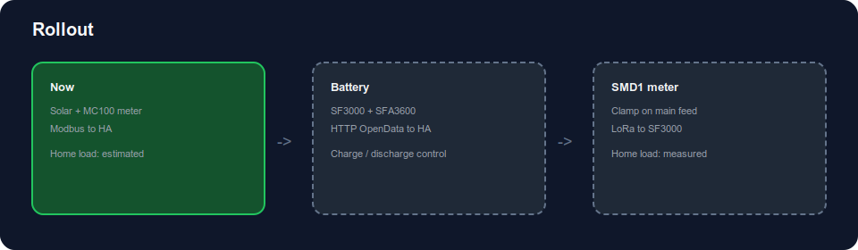

# Setup guide

[](diagrams/system-overview.svg)

[](diagrams/phased-setup.svg)

## Your hardware layout

| Component | Role |
|-----------|------|
| 18× 500 W Atmoce PV panels | Solar production (9 kWp nameplate) |
| 9× 1000 W microinverters (2 panels each) | DC/AC conversion |
| Atmoce **MC100** combiner | String aggregation, grid metering, Modbus API |
| Indevolt SF3000AC | AC-coupled hybrid inverter / storage controller |
| Indevolt SFA3600 | Extended LiFePO₄ battery pack |
| [Solarman SMD1](https://fr.indevolt.com/products/solarman-lora-compteur-electrique-intelligent-smd1) (LoRa) | Whole-home consumption meter → SF3000AC |

The SF3000AC is the network endpoint for Home Assistant. SFA3600 packs appear as `pack_1_soc`, `pack_2_soc`, etc. The SMD1 does **not** get its own HA integration — meter data arrives via the SF3000 OpenData API (`meter_power`). See [`docs/smd1-meter.md`](smd1-meter.md).

## Step 1 — Reserve static IPs

Give stable DHCP reservations to:

- Atmoce MC100 combiner (`192.168.1.8`)
- Indevolt SF3000AC (example `192.168.1.51`)

## Step 2 — Enable Atmoce Modbus

1. Open **Atmozen**
2. Confirm the MC100 combiner is online
3. Ask your installer to enable **Modbus TCP** if the option is not visible
4. Verify port `502` from a workstation:

```bash
nc -zv 192.168.1.8 502
```

## Step 3 — Enable Indevolt local API

1. Indevolt app → profile → create **direct device connection**
2. Device settings → **Local API** → protocol **HTTP**
3. Verify OpenData:

```bash
curl -g -X POST -H "Content-Type: application/json" \
  "http://192.168.1.51:8080/rpc/Indevolt.GetData?config={\"t\":[6002]}"
```

Expected: JSON with key `"6002"` (battery SOC).

## Step 4 — Install integration

Follow the README installation section, then add the integration with both IPs, `atmoce_panel_count: 18`, and `atmoce_microinverter_count: 9`.

## Step 5 — Optional HEMS package

Include `packages/ha_atmoce_indevolt_hems.yaml` and adjust entity IDs after the first restart.

## Troubleshooting

| Symptom | Check |
|---------|-------|
| Atmoce cannot connect | Modbus enabled, correct IP, same VLAN, no guest Wi-Fi isolation |
| Indevolt cannot connect | HTTP API enabled, port 8080, firmware supports OpenData |
| Pack SOC unavailable | Pack not detected in app; only connected packs expose SOC points |
| HEMS sensors missing | Both Atmoce and Indevolt must be configured in the same entry |
